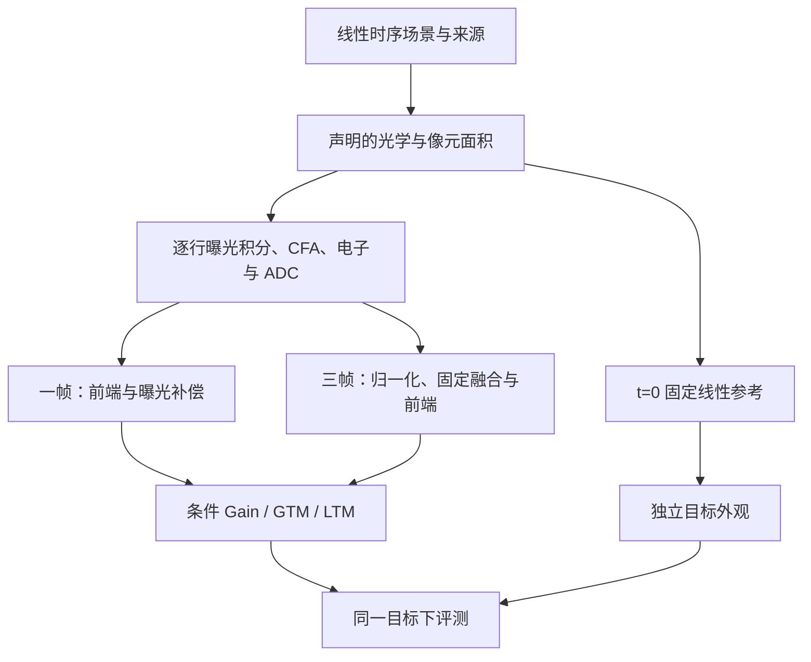

# 数据合成方案：共享物理采集，单帧与 HDR 两条任务链

2026-10-05。依据用户给定设计，核对代码基线 `6090197`（Bayer 实现来自 `f726419`）。本文是**现有实现的技术合同＋后续研究数据建议**，不是新增画质实验结果。可执行步骤见 [REPRODUCE_DATA.md](REPRODUCE_DATA.md)，已有字段说明见 [DATA_PIPELINE.md](DATA_PIPELINE.md)。

## 1. 目标、路线与证据分层

共同问题是：在同一目标外观和合法采集预算下，怎样采集到更有用的信号，并由 TM 恢复期望外观？采集曝光和渲染亮度不能合并成一个乘法标签。

| 层级 | 数据／用途 | 当前状态 | 不能证明什么 |
|---|---|---|---|
| L0 物理检查 | 常量、边缘、脉冲、移动亮点；验证单位和算子顺序 | 有采集与数据测试 | 真实画质、场景泛化 |
| L1 软件闭环 | 解析时序场景，经 RGB 或原生 Bayer 模拟，跑八组 | RGB 40 场景旧实验；Bayer 12 场景小实验均有记录 | 真机提升；不能把两种输入域的数值混为一组 |
| L2 研究训练 | 有来源与时间证据的线性 HDR 动态素材＋固定传感器配置 | 导入/采集接口已有；实际研究数据集待建设 | 导入成功不等于干净参考或真实动态可信 |
| L3 设备验证 | 实测 RAW、暗场、平场、运动与独立测试片段 | 未完成设备标定和独立真机测试 | 不能称当前默认参数为 Apple/Samsung 手机参数 |

建议采用 L2 主链，先通过 L0/L1。sRGB unprocessing、RawGen 和 RL-3A 代理用于内容扩充或预训练，不作为未裁切高光、绝对光子率和真实时间运动的权威监督。完整光谱/波长 PSF 留作可独立验证的扩展，不作为首版必要条件。

两项专利的技术借鉴边界：Apple [US9432647B2](https://patents.google.com/patent/US9432647B2) 的摘要明确不依赖多张包围曝光融合，并通过曝光与 DRC 配合；Samsung [US12243201B2](https://patents.google.com/patent/US12243201B2/en) 包含多曝光融合、统计估计 virtual gain 并参与 TM 函数构造。**时序网络、可学习 bracket、神经条件 TM 与本文数据方案是本工程的研究设计，不是专利已经验证的学习算法。** 其他来源的实际使用范围见 [SOURCES.md](SOURCES.md)。

## 2. 共享模拟器：三个量、两个坐标系

| 量 | 改变的物理/渲染过程 | 不应被替代为 |
|---|---|---|
| 快门 `exposure_s` | 曝光窗、期望光电子数、运动积分 | 只对已经采集的图乘 gain |
| 模拟增益 `analog_gain` | 已积累信号与电子读噪到 ADC 的增益、ADC 饱和余量 | 增加光子数；独立于设备的 ISO 噪声标签 |
| virtual gain | 融合/补偿后目标亮度与 TM 曲线条件 | 第二次物理曝光；恢复饱和或遮挡信息 |

当前 scene 值是 `sensor_linear_relative_radiance`：参考快门 `t_ref`、单位模拟增益下，值 1 对应模型满阱参考白。它不是 W/sr/m² 等绝对辐射单位，也不是已经乘曝光的 RAW。所有帧和候选保持同一尺度。

令光学、像元面积、CFA 之后的相对信号为 $L_p(u)$，模型的期望电子数为

$$
\mu_{i,p}=\frac{Q_{\rm FW}}{t_{\rm ref}}
\int_{s_i+\tau_p}^{s_i+\tau_p+t_i} L_p(u)\,du.
$$

这里 $Q_{\rm FW}$ 是模型满阱电子数。代码先计算曝光窗平均，再乘 $t_i/t_{\rm ref}$ 和 $Q_{\rm FW}$，与该积分等价。动态源按给定样本作分段线性插值并精确积分；“积分精确”只对该插值模型成立，不代表源视频采到了所有真实快速运动。

符号 $s_i$ 是曝光起点；manifest 实际保存中点 $c_i=\texttt{centers_s}[i]$，二者关系为 $s_i=c_i-t_i/2$。本版行偏移 $\tau_p$ 从首行的 $-rs/2$ 到末行的 $+rs/2$；不能直接将中点当起点代入上述积分。

本版电子/ADC 链可以写为

$$
n\sim{\rm Poisson}(\mu),\quad
e=\min(n,Q_{\rm FW})+\epsilon_r,\quad
d={\rm clip}_{[0,D_{\max}]}\!\left({\rm round}\left[b+
(D_{\max}-b)g_a e/Q_{\rm FW}+\epsilon_{ADC}\right]\right).
$$

先积分再限制满阱，不先裁切每个时间样本。电子读噪在增益之前，ADC 噪声在增益之后；当前二者均为全局标量假设。`raw_dn` 为含 black level 的量化数值，使用 float32 容器保存；去马赛克前按 `(DN-black)/(white-black)` 解码，不提前把负读噪裁成零。

当前处理顺序由 `acquisition.prepare_scene`、`capture_raw` 定义：

实现将光学卷积和像元面积处理应用于各时间样本，然后按 native sensor 行积分。全局快门下，固定线性空间算子与共同时间积分可交换；rolling shutter 下跨行 PSF 与逐行时间权重通常不能交换。CFA 在噪声前选择实际测量通道，不能对三个完整 RGB 通道独立加噪后冒充 Bayer。

### 默认配置与必须披露的近似

| 项目 | 当前默认/能力 | 科研使用要求 |
|---|---|---|
| 传感器 | 10,000 e⁻ 满阱；3 e⁻ 读噪；0.5 DN ADC 噪声；12 bit；black=64；`t_ref=1/120 s` | 工程假设，设备参数应由实测替换 |
| 色彩 | 默认 WB=1、CCM=单位矩阵；导入 XYZ 需显式矩阵 | 不把标准线性 sRGB 直接改名为 camera RGB；不是光谱等价模拟 |
| 光学 | 默认 `post_optics`、不加 PSF；`pre_optics` 可用固定三通道 PSF | 源已含光学模糊时不能再叠完整目标 PSF；记录 PSF 空间不变和边界近似 |
| 像元面积 | 整数块平均、保持相对强度 | 这是离散采样近似，不自动标定物理像元面积/QE/像素 pitch |
| 快门/读出 | 默认 rolling=0、尾部 readout=1 ms；支持逐行偏移 | rolling span 与尾部 readout 含义不同；不是任意手机重叠读出模型 |
| 前端 | 双线性去马赛克，固定 WB/CCM | 无生产级 DN、去鬼影；去马赛克噪声协方差未完整传播 |
| HDR F0 | 观测驱动全局整数平移、运动拒绝、逆方差融合 | 不使用真实 flow/visibility；不能声称解决非刚体运动与遮挡 |

`AcquisitionProfile` 是整包配置；不要以为只在某条 scene 的 provenance 写 `pre_optics` 就改变了采集。需按来源成像阶段分包，或预先按统一合同处理。

## 3. 源素材准入与分组

| 来源 | 可用角色 | 必须检查 | 不能自动补全 |
|---|---|---|---|
| 已声明线性 HDR 静态源 | 基本 AE/TM、高光与噪声测试 | 颜色域、未裁切范围、源噪声/PSF、整场景尺度 | 真实运动、遮挡和预览突变 |
| 高时间采样的线性 HDR 序列/渲染序列 | 主动态训练集 | 时间戳、源曝光窗、真实/插帧时间分辨率、光照/运动连续性、参考 t=0 | 低帧率缺失的时间信息、已含的长曝光模糊 |
| 目标设备 RAW/暗场/平场 | 标定、域校验、独立测试 | 有效 shutter/gain、black/white、模式、温度、原始来源 | 仅由 ISO 反推模拟/数字增益分解 |
| unprocessing/生成/处理后代理 | 内容扩展、预训练 | 明确代理身份、残余噪声、裁切和逆变换假设 | 未采到的高光、真实光谱、真实运动轨迹 |

输入支持 float NPY/NPZ、受约束的 EXR/float TIFF；本版不从文件扩展名猜测线性化。NPZ 帧键为 `frames`，mask 键为 `mask`；具体格式约束见复现文档。

数据准入流程：

1. 先按原始 episode、场景、对象/拍摄 session 及依赖关系划分 train/val/test，再产生 crop、亮度、噪声与曝光变体。
2. 每个 episode 固定一个 `radiance_scale`；不同增强版本可以另建 scene，但保持 `source_id` 和 split，不按候选单独归一化。
3. 固定线性颜色变换和成像阶段；XYZ 转 sensor 产生负值时，当前实现会裁负并记录比例，不能隐去色域近似。
4. 声明 source 的曝光模糊、降噪、源饱和、插帧与 PSF 信息。当前 `clean_reference_verified` 只是调用方布尔声明，不是自动真值认证，也不会阻止未认证数据参与训练。
5. 动态序列要覆盖所有历史预览及最终曝光窗，包含 t=0；不能复制边界帧补未来。单帧源则被解释为时间不变场景。
6. 对未经证明干净的源单独报告结果。不得将“成功导入”“validator 通过”升级为可信高光/运动监督。

建议每个原始 episode 保存数据来源/许可、色彩域与矩阵、源 shutter/时间采样、原始是否饱和、光学阶段、参考验证方法和设备配置。尚无专门 schema 的项放在来源说明/独立 sidecar 中；它们不因此成为现有模型输入。

### 时间采样与空间处理的验收建议

以下为待执行的数据资格检查，不是现有 CLI 自动功能：在快速边缘/遮挡/频闪子集加密时间采样，比较曝光积分及候选排序是否稳定；先在训练/验证源上固定容差，再用于测试。真实低帧率序列无法通过简单重复或线性插帧获得同等证据。crop 必须对所有时间样本、mask 和两个任务一致，并保留 CFA 相位及足够运动/PSF 边界。

## 4. Apple 单帧任务

一个单位为 $(P_{past},\{a_k,RAW_k\},H_{ref},Y^*,metadata)$。AE 只接收历史预览与生效曝光；$a_k=(t_k,g_{a,k})$ 选择一次最终采集。TM 输入保留真实曝光尺度，按实际 $t,g_a$ 补偿一次；后续渲染增益独立决定外观。

当前 12 个候选：`base=min(t_ref,1/120)`，快门为 `base×(0.125,0.5,1,4)`，模拟增益为 `(1,2,4)`，digital gain 固定 1。默认快门范围 1/960–1/30 秒。库含相同有效 EV、不同快门/增益的组合，便于观察光子/拖影差异。

| 场景覆盖 | 应观察的物理关系 | 当前解析 demo |
|---|---|---|
| 低动态范围静态 | 增采光、渲染压回目标，测暗部方差与纹理 | 暗静态存在，但 demo 仍有亮点；需另建受控平场/低 DR 源 |
| 静态高动态范围 | 减曝光保高光、TM 保持主体目标 | 逆光类有强亮点，但该类主体也可能运动；需补纯静态 HDR 对照 |
| 低光运动 | 等外观下比较短快门噪声与长快门拖影 | 有解析平移；不是自然人体运动 |
| 小光源/反光 | 区分可容忍点状裁切与重要细节 | 有固定亮点；未含重要性标签 |
| 预览后突变 | 检查历史信息失效下的策略 | 缺少专用突变/失效子集 |

不能把“最后更接近目标亮度”当作 AE 好：旧实验 A10/A11 的高曝光选择已经展示了**饱和后画面变平，平均外观误差却下降**的反例。数据要能揭示此失效；本轮不改变旧损失或重新美化旧结论。

## 5. Samsung 三帧 HDR 任务

一个单位为 $(P_{past},\{a_k,RAWburst_k\},H_{ref},Y^*,metadata)$，$a_k=\{(s_i,t_i,g_{a,i})\}_{i=1}^3$。固定帧数、顺序、F0 和共同预算，再比较计划和渲染。

当前三帧 nominal centers 为 `(-1/30,0,+1/30) s`，采集窗口 `[-50,+50] ms`，不是允许快门任意扩展的抽象中点。逐行中心跨度为 `rolling_shutter_s`；末行结束后加 `readout_s`。历史预览 centers 为 `(-4/30,-3/30,-2/30) s`，全部读出须早于最终第一曝光开始。

24 个计划含 12 个固定 ±2 EV 包围与 12 个窄/不对称包围。为容纳 rolling/readout，`build_acquisition_plans` 用全库共同因子缩短快门，保持包围比值。默认 1 ms 尾部 readout 时因子为 0.94：最大快门约 31.333 ms，**不再是旧 RGB 实验的 33.333 ms**。真实动作以 manifest/checkpoint 为准。固定窗口并不等于每个计划总开光时间相同。

每帧归一化到公共辐射单位一次，固定 F0 输出 $\hat H$；TM 使用

$$Y=T(\hat H;v,\theta,\operatorname{stats}(\hat H)).$$

本版 `learned_tone.py` 用 GainNet×用户意图得到初始增益，再预测残差，以最终总增益的目标 PDF 控制 shoulder，并只在像素值上施加一次最终增益。虚拟增益不修改归档 RAW，不提高其采样 SNR，也不是“模拟增益越低越好”的通用证明。

实际 HDR 数据还需分层覆盖：相机平移/旋转、局部非刚体运动、前后景遮挡与显露、主体跨曝光边界、频闪/光照突变、短曝欠采样与长曝饱和。当前 demo 是解析纹理与移动亮斑，没有真实深度、光流或逐帧 visibility GT。

若后续引入 visibility，需在独立诊断层明确坐标系、参考时刻和遮挡定义；不可直接把 `missing` 或 `reliability` 改名为 visibility，也不可把未来 GT 注入 AE 观测。当前 v2 数据包没有专用 visibility 字段。

## 6. GT、区域与训练合同

当前参考是**t=0 的光学和像元面积处理后的完整 RGB 场**，在有限运动积分、CFA、噪声和裁切之前；再固定 WB/CCM 得到 `sharp_reference`。目标为

$$x=2^z H_{ref},\quad Y^*=\operatorname{sRGB}\left(\frac{x}{1+\max_c x_c}\right).$$

这里 `z=render_ev`，首轮固定 0。当前不是任意主体亮度/风格向量，不能说多风格条件训练已完成。所有候选及两方案共用目标；调整 `render_ev` 必须重新生成物理数据包，不能在同一次对照中逐图配平亮度。

这个 GT 不要求去除镜头 PSF，但仍会惩罚 CFA/去马赛克近似及参考采样误差。可另做无噪声固定前端参考的诊断，隔离这一误差底限；不能中途替换主 GT。`subject_mask` 固定在参考坐标；缺失或全零时，当前主体亮度项退化为全图亮度，不能把该结果称为人脸/主体指标。

| 组 | 采集策略 | TM | HDR F0 |
|---|---|---|---|
| A00 / S00 | 冻结、仍随场景变化的规则 | 冻结、仍图像自适应 | 固定 |
| A10 / S10 | 学习 | 冻结 | 固定 |
| A01 / S01 | 同一规则 | 学习 | 固定 |
| A11 / S11 | 学习 | 联合学习 | 固定 |

“固定 AE”在当前代码中是固定规则，不是所有场景同一快门。Samsung 规则只在固定包围子集中选择，学习策略可用全库，因此现有四组没有隔离候选空间扩展。下一轮若要声称 bracket 学习收益，应增加同候选库规则/搜索对照，以及固定形状/可变形状消融；这些属于新实验，不混入既有四组结论。

训练以 train 上当前 TM 的候选质量反馈学习 AE，用 val 选 checkpoint，test 只评估。离散期望让梯度到达 AE 概率和 TM，不对量化/Poisson 反传。缓存仅含冻结 ISP 系数，不缓存变化中的 adapter 输出。候选最优动作只对该后端、目标、噪声重复和候选库有效；不称作场景固有 AE 真值。

同一方案必须共用 source split、预览、传感器、计划库、归档噪声、GT、F0、初始化、选模与评测。匹配模块更新次数不等于匹配 FLOPs/时间，需另报告枚举候选数及训练耗时。场景内平均噪声和训练种子，再按独立 episode/场景配对统计，不把噪声重复当独立场景。

## 7. 先验收生成器，再验收研究结论

| 用户要求的检查 | 本版已有证据位置 | 仍需的研究级证据 |
|---|---|---|
| 辐射一致性 | `tests/test_capture_tm_simulation.py`、`test_capture_tm_acquisition.py`、RAW 重算 validator | 标定传感器上非饱和区域、量化误差内的一致性；重算一致不等于物理真实性 |
| 快门与增益不同 | `test_raw_exposure_collects_photons_while_analog_gain_does_not` | 多增益/模式实测读噪、满阱和 ADC 余量曲线 |
| 运动积分 | 分段线性积分、逐行时间与 triangle fixture | 匀速边缘实际运动路径、模糊宽度随快门变化及时间加密收敛 |
| 饱和在积分后 | `test_full_well_clips_after_linear_integration_and_before_analog_gain` | 移动高亮/短时闪光源、真实饱和与拖影匹配 |
| virtual gain 独立 | `tests/test_capture_tm_learned_tone.py` 的增益/PDF 测试 | 固定 RAW/F0 的专门 virtual-gain 质量消融 |
| GT 与因果性 | `test_export_preserves_native_bayer_and_fixed_targets_for_both_schemes`、预览时钟与 target 篡改拒绝测试 | 真实请求/生效延迟、动态预览分布和持续闭环 |

当前默认指标为 display MSE、主体/全图亮度 MAE、梯度 MAE、观测 missing、辐射 MSE、暗/高光 MSE；噪声重复数至少为 2 时才报告 `rendered_repeat_variance`。一个噪声种子的 Bayer 小实验没有该方差指标。**PSNR/SSIM、运动边缘清晰度、遮挡鬼影和主观质量尚非这条 runner 的完整默认报告。** 暗/高光空区域目前计零，研究报告应同时报告区域存在率；重复方差仅代表随机变化，饱和常量图也可为零。

下一轮建议固定的报告面板（待补，不宣称已实现）：

- 整体：固定 display 目标下的 PSNR/SSIM与影调误差，不做逐结果自由亮度对齐。
- 暗部：bias、重复方差、纹理保真分开；固定参考掩码，报告有效样本量。
- 高光：重要高光区域的可用测量、裁切和纹理，区分可容忍点状光源。
- 运动：参考边缘位置误差/宽度与纹理损失；不把纯降噪平滑当去模糊。
- HDR：visibility/遮挡子集上的鬼影、局部失配与 fallback 行为；无 GT 时标为代理或人工评测。
- AE：动作分布、场景条件响应、时序稳定性、相对候选 oracle 的 regret；检查是否再次集中到恒定动作。

推进顺序：L0 物理关系与源合同 → L1 静态/动态协议 → L2 真实内容与受控压力子集 → 设备标定与 L3 留出测试。只有生成器可用还不够；旧失败实验已经说明代理代价会奖励错误的物理策略。后续改变损失、保护约束或目标外观，应先在 train/val 确定，再使用新的未访问测试集。
