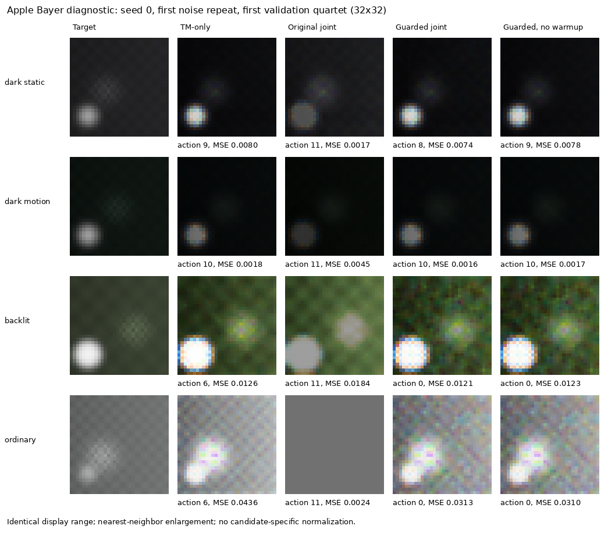

# AE–TM 联合失败诊断与 Bayer 最小修正复测（2026-10-09）

**结论：目前没有足够证据证明联合训练具有独立于采集保护、TM 校准或顺序方案的研究收益。** Apple 的采集信息退化可以被一个因果曝光风险约束大幅缓解，但保护后的联合组仍有细节损失，并被本合成任务的已知目标曲线顺序对照超过。Samsung 的联合收益仍不稳定；本次风险代理对默认 HDR 动作库完全失效，存在预测零风险、实际全帧饱和的可复现反例。保留这些负结果，不据复合 J 的改善声称画质改善。

本报告补充 [原八组结果](JOINT_RESULTS.md)，不替换原 test 数字。新增结果来自 Bayer 开发诊断，评估 **val**，不是新的独立 test，更不是实际 iPhone/Samsung 成片结论。

## 1. 失败链条：目标函数允许真实信息换取外观

原目标为 `J = display_MSE + 0.2 subject_luma_MAE + 0.05 gradient_MAE + 0.02 missing_fraction`。最后一项取值有界于 [0,1]，最多增加 0.02；前三项衡量目标外观，并不要求目标外观来自正确的辐射测量。

原 RGB 实验 Apple A00→A10 的 J 减少 0.049533，其中 missing 惩罚**增加** 0.009489，显示项却减少 0.059022。因此优化器受到明确激励：只要让冻结 TM 的输出更像目标，牺牲测量是划算的。不是把复合指标错算，也不能仅凭更大的损失权重保证保真。

曝光归一化没有解决信息丢失：某通道观测为 `min(e × L, 1)`，归一化后是 `min(e × L, 1)/e`。大曝光将饱和通道的辐射估计压到 `1/e`；动作 11 的有效倍率达到 16 时，上界只有 0.0625。高曝光并非只使最终图变亮；它可以把高辐射内容压扁，改变冻结、图像自适应 TM 的系数与输入分布，降低显示误差。这与 RAW 饱和、辐射误差和高光误差上升同时出现。

四类原因须分别处理：

| 因素 | 实测证据 | 可作出的判断 |
|---|---|---|
| 目标函数 | 原 J 可用约 0.0095 的信息惩罚换约 0.0590 的显示收益；Bayer 原联合同样破坏测量 | 主要激励错误，非仅训练不收敛 |
| 动作空间 | Apple 存在安全且不同场景需要不同的动作；Samsung 规则固定 bracket 子集与学习 24 个计划不等价 | Apple 不需先扩库；Samsung 后续须补相同 bank 的规则/常量对照 |
| 策略集中 | 原联合三种子各八个 val 场景均选择动作 11，软分布接近单点；给定已训练 TM 的场景 oracle 却需要多个动作 | 有集中与上下文遗憾；增加 hard action 数本身不证明学习了语义 |
| 冻结 TM 外观偏差 | Apple 冻结初始 TM oracle 为 {10:4,11:3,3:1}；同 RAW 的解析保真 oracle 为 {6:4,7:2,0:2}，八场景零动作一致 | AE warmup 教师偏好由冻结外观驱动；应审计教师，而非默认其为曝光真值 |

AE warmup 是冻结 TM 成本标签的交叉熵，随后用所有候选的**精确期望成本**训练 AE，并优化小型 TM adapter（2,663 个参数；冻结系数网络 207,224 个参数）。AE 有 56,177 个参数。部分 AE-only 所选早期 checkpoint 的软分布较平，期望优化与部署 argmax 存在差距；但已收敛联合组的概率几乎全在动作 11，这不足以解释其主要失败。去掉 warmup 也没有普遍解决集中。

## 2. 最小修正：因果预览风险约束，原 J 保持不变

使用现有三帧历史预览、实际 t/gain metadata 和候选 EV，投影最新预览的线性通道值。每个计划的风险是“同一通道/像素在计划**全部帧**均预测 ≥0.98”的比例；只允许 `risk(candidate) ≤ risk(rule) + 0.01`。短帧能保护 HDR 信息，不因长帧局部饱和就误杀整个 bracket。规则动作保持可选，阈值与容差在训练前固定。

这个约束不使用候选真实 RAW、未来帧或目标；后者仅用于事后诊断。没有更换原显示损失、融合、WB/CCM、模型容量或扩大动作库。开关默认关闭，旧 checkpoint 行为保持。训练、teacher 标签、模型选择和部署使用同一可行动作集合。若驱动只允许非固定 bracket 的子集，使用子集中最低预测风险计划作参照，并继续与驱动可行性相交。

它是**风险代理，不是采集信息安全保证**：已剪裁预览只是辐射下界，噪声、运动、full-well 响应和 Bayer 插值也会破坏线性投影。以下 Samsung 反例实际证伪了其通用性。

代码位置：

- `capture_tm/learned_policy.py::preview_clipping_guard`：风险与 mask。
- `capture_tm/joint_experiment.py`：候选 mask、warmstart、训练、评估与 checkpoint。
- `capture_tm/joint_cli.py`：`--clip-risk-tolerance`；`joint_algorithm.py`：部署恢复与外部可行子集。
- `research/ae_tm/diagnostics/preview_risk_ablation.py`：复用现有 Bayer cache/trainer 的受控消融。
- `tests/test_capture_tm_risk.py`、`tests/test_preview_risk_statistics.py`：物理反例、关闭兼容、训练/部署一致与空高光区域统计。

## 3. 公平复测与分别验收

同一现有生成器：40 个 32×32 RGGB 场景，data seed 2026，24 train、8 val、8 test；noise 0/1，training seeds 0/1/2。新增学习、审计与模型选择仅使用 train/val。整份 RAW archive 的结构/重组校验包含生成的 test 文件，但未用它们选择方法或报告学习收益。

| 消融 | 训练运行 | 改动与用途 |
|---|---:|---|
| 原八组 | 8×3=24 | 同次 Bayer 原基线 |
| 受保护八组 | 8×3=24 | 只增加风险约束，warmup 10、main 10 不变 |
| 受保护、无 warmup 八组 | 8×3=24 | 主训练预算不变，隔离冻结教师；AE 总更新更少 |
| 仅推理保护 | 4 个学习组×3=12 次评估 | 使用原 checkpoint，零额外训练，隔离输入分布变化 |

共 72 次主训练；每个启用模块主训练 480 次更新，AE warmup 240 次。无 warmup 的 AE 总更新为 480，其他学习 AE 为 720，不能声称总计算量相等。HDR 计划满足同一时间窗，但快门时间不同；控制相同更新数也不是相同采集时间。主脚本 CPU wall time 1012.9 秒（含该脚本准备/审计），不作为硬件吞吐结论。

分别记录：① native RAW 全帧饱和、测量 missing、归一化辐射 MSE；② hard/soft 熵、动作分布、可行场景 oracle 与同一 TM 的最佳共同可行常量；③显示 MSE、主体亮度、梯度 MAE、固定高光区域误差。J 仅作附属记录。高光 mask 固定为 target luminance >0.8，八个 val 场景只有两个含高光，各 31 像素；没有高光的场景记为空，不能用六个零值稀释。原 `highlight_mse` 字段保留历史口径，本文使用 `highlight_mse_valid_regions`。

以下全局均值先合并 noise、种子，再按场景等权。梯度误差越低越好；radiance MSE 在未压缩辐射域，受高辐射尾部影响，不是显示 MSE 的替代。

| 方案 | J | 显示 MSE | 梯度 MAE | 辐射 MSE | missing | native 全帧饱和 |
|---|---:|---:|---:|---:|---:|---:|
| Apple TM-only | 0.040234 | 0.013333 | 0.018189 | 0.093121 | 1.335% | 2.014% |
| Apple 原联合 | 0.031125 | 0.007228 | 0.013366 | 0.152814 | 34.389% | 36.060% |
| Apple 受保护联合 | 0.036072 | 0.010961 | 0.022341 | 0.017674 | 0.749% | 1.184% |
| Apple 仅推理保护 | 0.084361 | 0.046756 | 0.017332 | 0.093131 | 1.379% | 2.108% |
| Apple 受保护无 warmup | 0.039002 | 0.012650 | 0.019672 | 0.062976 | 1.131% | 1.750% |
| Samsung TM-only | 0.039736 | 0.013043 | 0.019104 | 0.090452 | 1.019% | 0.934% |
| Samsung 原/受保护联合 | 0.039588 | 0.012969 | 0.019332 | 0.090474 | 1.117% | 0.934% |

Apple 约束后各种子分别用 3/3/4 个动作，平均保留 8.5/12 个候选；同已训练 TM 的可行 oracle 成本遗憾由 0.003903 降到 0.000623。场景可行 mask 本身能制造多样性，所以仍需 oracle 和最佳常量对照，不能用熵单独验收。仅在推理时加保护反而显著退化，说明 TM 必须适配被保护的采集分布。

受保护 Apple 相对 TM-only 显示 MSE 减少 17.8%，梯度误差却增加 22.8%。按场景配对、合并种子与噪声后的描述性 95% bootstrap 区间：显示差 −0.002372 [−0.005395,−0.000369]；梯度差 +0.004153 [+0.001490,+0.006647]；辐射差 −0.075448 [−0.166392,+0.000042]。这些是用于开发与模型选择的八个 val 场景，**不作确认性显著性结论**。两个高光场景显示 MSE 为 TM-only 0.010180、原联合 0.139010、保护联合 0.008944；样本量仅二，不外推。

### Samsung 约束失效的可证伪反例

默认 Bayer HDR bank 中，每个计划至少有一帧相对最新预览的有效曝光 ≤0.94000006。预览被限制到 ≤1，因此该帧的预测值永远 <0.98；“全部帧饱和”预测风险对全部 24 个计划恒为零。三个种子仍在所有 val 场景选计划 11，约束等于没有作用。因此原/受保护组相同不能判断一个有效的 HDR 保真约束是否有用。

`preview_censoring_witness.py` 构造相对辐射 2 的静态 32×32 RGGB 场景：有噪声历史预览、无噪声最终采集以隔离剪裁；计划 11 **预测风险 0、仍被允许、真实 native 全帧饱和 100%**。这是独立物理单元反例，不混入质量均值。Samsung 显示差 −0.00007449，描述区间 [−0.00026127,+0.00004902] 包含零，测量没有改善。下一步须提供未饱和的短曝光因果观察或明确的辐射不确定性处理；仅调 J 权重或这个阈值不能补回已经失去的可观测性。

## 4. 后验强对照：改善是否只是已知目标校准？

在上述训练完成后，增加**无额外优化**的解析对照，用同一 RAW 和前端，将合成任务既定 `fixed_target` 曲线（最大通道 Reinhard＋sRGB）作用于**曝光归一化的实际采集图**。没有把 latent 或目标图交给 renderer。比较规则 AE＋解析 TM、冻结受保护 AE-only checkpoint＋解析 TM。这个对照是后验审计，未伪装成预注册八组；已知精确目标曲线是结构性优势，因此不是容量匹配的训练基线或普适专家风格的 TM。

| Apple 方案 | 显示 MSE | 梯度 MAE | 辐射 MSE | 高光 MSE（2 场景） |
|---|---:|---:|---:|---:|
| 受保护联合 | 0.010961 | 0.022341 | 0.017674 | 0.008944 |
| 规则 AE＋已知解析 TM | 0.000563 | 0.009356 | 0.093121 | 0.027186 |
| 冻结受保护 AE-only＋已知解析 TM | **0.000417** | **0.011032** | **0.002670** | **0.001710** |

规则 AE 的解析 TM 改善平均外观，却仍有高光信息损失；受保护 AE-only 后接匹配曲线同时超过当前受保护联合的上述四项。这直接限制了“联合必要性”的解释。这里 AE-only 仍由冻结外观教师训练，不能称为独立实现的信息优先 AE。Samsung 规则/冻结 AE-only＋解析 TM 的显示 MSE 分别为 0.000520/0.000533，但高光约 0.024366，高于联合组的 0.010408，不能声称全指标支配联合组。渲染曲线本身不会改变采集辐射信息，Apple 信息改善来自 AE-only 所选动作。

可能仍存在实际 AE–TM 协同收益的假说，但本实验没有证明它。下一轮应换为真实或独立定义的专家目标，先给 TM-only 足够拟合能力/训练，再与保护 AE 固定后顺序训练 TM、同 bank 常量/规则、联合组公平比较。

## 5. 复现与证据

训练源快照：[5e5b01183a609fdc5624a113c3ab776efcc88859](https://github.com/baolinv0/modular_neural_isp/commit/5e5b01183a609fdc5624a113c3ab776efcc88859)，tree `1bb66fcef10b5a96df4eb77c755b10937a127f7a`，与本地训练记录 commit `115b133` 内容一致；后续提交只修复外部子集 fallback、统计及诊断报告。阈值/损失/训练配置没有根据 val 再调。完整训练配置、候选审计、场景记录和校验日志见 [证据包](preview_risk_evidence.zip)，（420,843 bytes，SHA-256 `caf7c3709982582a2e6aefb8f8c77c6c0d5a71030cafeaca73faaa2a8f1ea50d`），便于不重训也能逐项审查；[摘要 JSON](preview_risk_summary.json) 保留均值、种子动作和配对区间。

环境：Python 3.12.14、torch 2.5.1+cpu、numpy 1.26.4，CPU；其余依赖按仓库及测试需求安装。本次使用 scipy 1.13.1、tifffile 2024.8.30、rawpy 0.23.2。仓库已有真实 style0 权重；需要这些权重才能复现。以下从仓库根运行：

```bash
python -m capture_tm.pipeline_cli demo --output runs/capture_tm/risk-diagnostic/data --scenes 40 --size 32 --scheme both --noise-seeds 0,1 --seed 2026 --threads 1
python -m research.ae_tm.diagnostics.preview_risk_ablation --manifest runs/capture_tm/risk-diagnostic/data/acquisition/manifest.json --output runs/capture_tm/risk-diagnostic/study --epochs 10 --warmup 10 --seeds 0,1,2 --prepare-threads 4
python -m research.ae_tm.diagnostics.preview_risk_ablation --manifest runs/capture_tm/risk-diagnostic/data/acquisition/manifest.json --output runs/capture_tm/risk-diagnostic/study --epochs 10 --warmup 10 --seeds 0,1,2 --prepare-threads 4 --refresh-existing
python -m research.ae_tm.diagnostics.preview_censoring_witness
python -m research.ae_tm.diagnostics.preview_analytic_reference --manifest runs/capture_tm/risk-diagnostic/data/acquisition/manifest.json --study runs/capture_tm/risk-diagnostic/study --output runs/capture_tm/risk-diagnostic/analytic_baseline.json
OMP_NUM_THREADS=1 MKL_NUM_THREADS=1 python -m pytest -q --disable-warnings
```

现有 RAW validator 已验证 `valid=true`、`raw_composition_verified=true`。主训练完成后重新计算报告修复空高光统计；旧 stdout 作为追溯记录，不是本文数值来源。另跑 12×16、单种子、warmup/main 各一轮的三套八组 fresh smoke，验证当前完整脚本从生成到报告可执行。完整测试 **394 passed、9 skipped、0 errors/failures**（185.85 秒；4 项需要 CUDA，5 项需要 OpenEXR）。新解析对照和反例脚本均实际执行成功。独立 reviewer 提出的部署可行子集与空区域统计问题已修复，并保留复测证据。



图：seed 0 的前四个 val 场景、同一 noise 的输出；target/TM-only/原联合/保护联合/保护无 warmup。32×32 最近邻放大、共同显示范围，无逐图归一化。标注 MSE 为该场景两次 noise 的均值，图像展示其中一次。它是失败样例，不能据低分辨率缩略图判断实际主观画质。

## 6. 后续预注册验收：三条证据缺一不可

1. **信息保留**：固定目标区域及 native RAW 标签，报告辐射误差、饱和、missing；保留暗部噪声和高光失真分项。加入静态极亮、局部亮斑、运动和预览剪裁反例，任何保护保证必须通过这些单元挑战。
2. **策略必要性**：同 bank 下最佳可部署常量、规则、oracle/regret 与 scene mask 对照；去掉 warmup、换教师、固定 AE 后训练 TM。熵/多样性只有在正确的场景适配及质量收益同时出现时才有价值。
3. **最终质量及独立联合收益**：更强 TM-only、受保护顺序 AE→TM、受保护联合共享数据、初始化、容量、主更新和相同采集预算，额外 teacher/搜索费用单列。按场景而非种子/噪声伪重复计算区间；预先定义显示、细节、高光和测量非劣条件。冻结方案后用新独立场景/真实目标评估。若只改善 J，或被顺序方案解释，判联合收益未成立；若信息改善但细节退化，报告 trade-off 而非总画质胜出。

当前可继续研究的是“可观测性可靠的采集保护＋与真实目标匹配的 renderer”；不能把本次 Apple 的 J 下降或 Samsung 的微小均值差写成联合优化成功。
