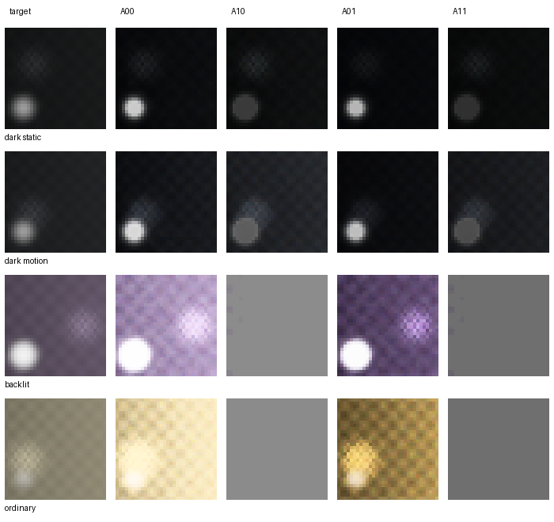
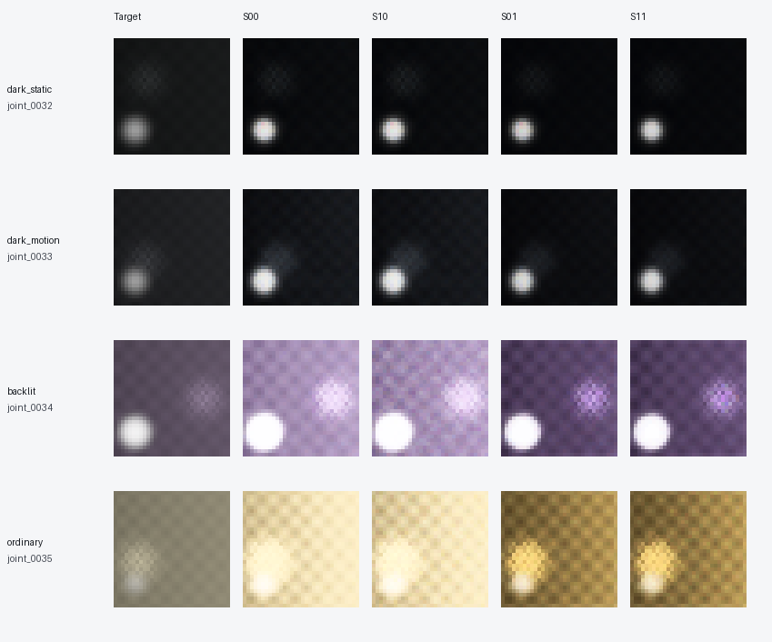

# AE–TM 两方案实验结果

**两条算法和八组实验均已完成，三训练种子共 24 组运行。首轮结果没有证明联合优化优于只训练 TM；Apple 还出现严重的曝光策略塌缩与饱和。工程闭环已建立，画质目标尚未达成。**

完整数值见 [joint_results.json](joint_results.json)，算法见 [JOINT_ALGORITHMS.md](JOINT_ALGORITHMS.md)，独立结果审查见 [JOINT_RESULTS_REVIEW.md](JOINT_RESULTS_REVIEW.md)。

## 协议与代码

- 40 个独立解析合成场景，32×32，24 train / 8 val / 8 test；每个 split 包含暗光静止、暗光运动、逆光和普通场景。
- 数据种子 2026；训练种子 0/1/2；两次采集噪声重复；AE 预热 10 epoch，再训练 10 epoch。
- 每个活动模块正式训练 480 次更新；AE 预热 240 次更新，在 10/11 两组共享预热权重。测试不参与模型选择。
- 更新次数匹配不等于计算量相同：仅 TM 每步渲染一个候选，学习 AE/联合组枚举全部候选。Samsung 的规则 AE 使用固定包围子集，学习 AE 使用完整库，因此本轮也未隔离动作空间扩展的贡献。
- Apple 12 个单次物理动作；Samsung 24 个三帧计划；数字增益固定为 1。原 TM 207,224 参数冻结，训练 2,663 参数的条件 adapter，AE 56,177 参数。
- 主要指标 J = MSE + 0.2 × 主体亮度 MAE + 0.05 × 梯度 MAE + 0.02 × 无可用测量比例。所有表中 J/MSE/误差越低越好。
- 无可用测量比例是观测代理：饱和、低于两倍噪声标准差，或 HDR 对齐/运动拒绝后均没有可靠样本；不是潜在真实信息损失标签。
- 深色/高光误差同时包含偏差和细节损失；空区域记 0，整体均值可能被稀释。重复噪声方差仅基于两个样本，不能单独充当画质指标。
- Apple 运行代码 `828a9bb`；Samsung 使用修正后的 `3d83a6f`（Apple 运算逐位保持一致）。Samsung 修正发生在其首次训练前，依据机制复审，未使用 Samsung 质量结果调参。

## Apple：单帧四组

| 组别 | J | display MSE | 辐射 MSE | 无可用测量比例 |
|---|---:|---:|---:|---:|
| A00 | 0.095231 | 0.054659 | 0.093714 | 1.69% |
| A10 | 0.045698 | 0.018411 | 0.160225 | 49.13% |
| A01 | 0.028709 | 0.008091 | 0.093714 | 1.69% |
| A11 | 0.031172 | 0.008374 | 0.160225 | 49.13% |

00=规则 AE＋冻结 TM；10=学习 AE＋冻结 TM；01=规则 AE＋学习 TM；11=联合学习。

联合组 A11 的平均 J 比基线低，但比 A01 高。A11−A01 = **+0.002463**，按场景配对的 95% CI 为 **[−0.010572, +0.017026]**；没有证据表明联合优于只学习 TM。交互项 I = **−0.051996**，CI 为 **[−0.111464, +0.000927]**，不支持超加性。

三个种子的 A10、A11 在全部八个测试场景都选择 action11：**1/30 秒、模拟增益 4**。A10 的验证最佳正式训练 epoch 均为 0，即采用 AE 预热后的模型；后续期望损失训练没有产生更好的验证动作。训练集最优标签实际分布在五个动作，规则 AE 也会随场景变化，因此候选库本身并非恒定动作。

学习 AE 的辐射误差和无可用测量比例均变差。两个普通场景的全部测量已饱和：曝光归一化后的辐射张量恒为 0.0625，两个噪声重复完全相同。因此零输出方差代表细节已丢失，不能解释为降噪。在逆光场景，A11 的高光误差也明显劣于 A01。

这表明当前代理目标、原 renderer 的外观偏差与策略集中共同允许“通过物理饱和改善平均外观误差”的失败解。测试集现象保留作失败分析，没有据此改变 Apple 的目标函数、数据、训练轮数或选模规则。

下图固定选择 seed0 的前四个测试场景（各条件一张），展示原始 32×32 输出的最近邻放大；没有挑选最佳图片。

## Samsung：三帧 HDR 四组

| 组别 | J | display MSE | 辐射 MSE | 无可用测量比例 |
|---|---:|---:|---:|---:|
| S00 | 0.095440 | 0.054898 | 0.055372 | 0.6836% |
| S10 | 0.095603 | 0.054636 | 0.000104 | 0.0014% |
| S01 | 0.029336 | 0.008385 | 0.055372 | 0.6836% |
| S11 | 0.029134 | 0.008380 | 0.010063 | 0.2285% |

联合组相对只学习 TM 的平均 J 降低约 **0.69%**。S11−S01 = **−0.000202**，按场景配对的 95% CI 为 **[−0.000637, +0.000179]**；仍不足以证明联合更好。交互项 I = **+0.000365**，CI **[−0.001618, +0.002178]**，也不支持确定的超加性。

仅学习 AE 的 S10 会区分暗光和明亮场景，明显减少采集/融合后的辐射误差与无可用测量；但成片 J 没有同步改善，重复噪声方差约为基线的 4.25 倍。这里的物理测量改善不能直接等同于成片画质提升。

**联合组也存在策略集中：** seed0/2 的八个测试场景全部选择 action9，seed1 全部选择 action0。二者都是固定 ±2 EV 包围曝光，模拟增益为 1，中央快门分别为 1/120 秒和 1/960 秒。S10 的 seed1 在四个暗光场景使用 action19（−1/0/+2 EV）；这证明扩展动作可被选择，但本次四组实验不能单独归因或证明不对称包围曝光的收益。

因此，Samsung 这轮支持“AE 能改变 HDR 测量质量、TM 能校正固定外观偏差”，尚不支持“联合策略稳定学习到更优采集—渲染协同”。联合组的辐射误差也高于仅学习 AE，下一轮需区分策略集中、最终外观目标与测量保真之间的冲突。

下图采用与 Apple 相同的固定样本规则，S01 与 S11 在该分辨率上的视觉差别较小。

## 验证边界

- 完整回归：**195 passed in 149.32s**。AE、TM、ISP 独立审查记录见 `reviews/JOINT_AE.md`、`JOINT_TM.md`、`JOINT_ISP.md`。
- Samsung v2 的默认零曝光意图下，GainNet 与学习残差仍参与目标 PDF 和曲线构造；隔离测试验证了该连接。四组比较不能单独证明 PDF 模块的质量贡献。
- 真实训练 checkpoint 的 A01/A11/S01/S11（seed0，第一个测试场景）已比对直接采集/推理与缓存评测；float32 不同 batch/线程数下，Apple 输出最大差异 2.03e−6，Samsung 最大差异 1.35e−6，均小于 1e−5 容差。这是软件推理一致性验证，不是真机部署验证。
- 仅八个独立测试场景。CI 先在场景内平均训练种子和噪声，再重采样场景；条件于本次训练，不能替代跨相机、大规模真实数据或主观画质评价。
- 独立 RGB 噪声、解析运动积分、固定平移对齐不等于完整手机 ISP；没有真实手机采集标定或 Bayer/rolling-shutter 验证。
- 本轮历史预览采用固定参考快门，尚未验证异曝光预览分布、持续闭环 AE、闪烁和设备控制延迟；不能据此宣称额外元数据输入本身具有实证收益。

## 后续研究含义

本轮不能把“联合网络可以反传”当成“联合优化带来更好画质”。优先问题是固定外观校准、保留物理信息的约束和 AE 策略集中，而不是继续提高当前复合分数。新的目标函数或采集保护机制应先在训练/验证集设计，再在新的未使用测试集评估。

## 复现与产物

运行命令见 [capture_tm/README.md](../../capture_tm/README.md)。当前代码可一次运行 `--scheme both`；本次 Apple 与 Samsung 分别执行，后者在机制修正后首次训练。冻结系数缓存耗时 Apple 337.11 秒、Samsung 978.74 秒；训练在 CPU 单线程运行。Python 3.12.14，PyTorch 2.5.1+cpu，NumPy 1.26.4。

随交付压缩包保留 40 个场景的 manifest/数组、24 个验证集选择的 checkpoint、逐组训练与评测日志、输出图片及推理一致性记录。为控制体积，不含可重建的候选缓存和末轮 checkpoint；所选 checkpoint 已保存完整模型状态。原始 ISP 权重仍从仓库按其许可获取。

## 2026-10-09 失败诊断与 Bayer 复测

已完成因果预览风险约束、72 次八组消融训练、物理反例和后验解析对照；当前未建立独立联合收益。新增结果仅为 val 开发诊断，原结果不变。见 [诊断报告](JOINT_FAILURE_DIAGNOSIS_20261009.md)。
