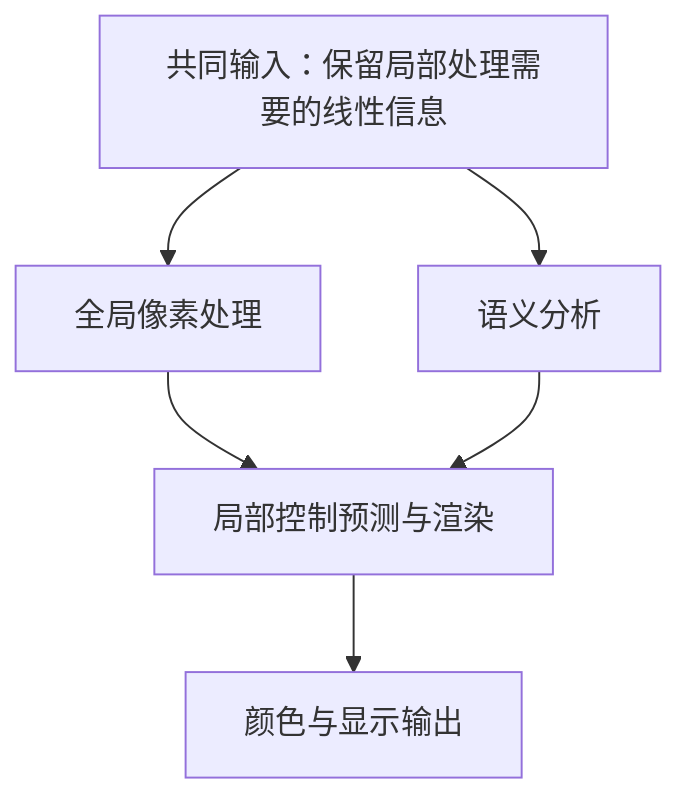

# 语义 Tone Mapping 算法库：动机、公开依据与实验定位

整理日期：2026-10-08。对应 `feat/tm-algorithm-library` 的 v2 实现；实现依据为提交 `3f7e8238eff579c704cf8c189fc17c7bec2d8b0c`。使用入口见 [TM 库 README](../tm_library/README.md)，实现与历史验收见 [v2 review](tm_library_v2_review.md)。

**本项目的动机是：在保留 Modular Neural ISP 可控渲染管线的基础上，用语义和图像条件决定局部处理方式，比较不同的受约束算子，并为未来 ISP/NPU 分工保留清晰的依赖关系。最终方案由真实相机实验决定。**

## 1. 从项目问题出发，而不是先选网络

项目定义是：使用 iPhone 成对数据训练 baseline，迁移到 S24 后，亮度、色调和整体 look 不理想；前置相机以人物为主要拍摄对象，希望参考同场景 iPhone 成片风格生成与 S24 对齐的伪 GT，再微调模型。

这至少包含四个可能不同的原因，不能直接归因于 LTM 表达能力不足：

| 层面 | 需要区分的问题 | 对方案的要求 |
| --- | --- | --- |
| 输入与标定 | 曝光尺度、黑白电平、WB/CCM、噪声及传感器响应发生变化 | 先核验线性输入契约和 upstream，不能让局部 TM 补偿所有标定错误 |
| 渲染算子 | 全局映射不能同时满足暗主体与亮背景，局部算子可能出现边界或细节问题 | 保留不同局部表示及多尺度机制，比较能力与约束 |
| 条件预测 | 同一亮度可能属于皮肤、天空或墙面；同为人物也有不同受光 | 比较图像特征、训练语义辅助和运行时显式语义 |
| 目标与监督 | 品牌风格、参考曝光或伪 GT 本身可能不稳定 | 将风格目标与运行时算子分开，检查监督质量 |

因此更准确的应用定位是 **“人像优先的完整 TM”**：处理整幅线性图，兼顾脸、身体、天空、窗户、衣物和灯光。无人像、夜感、剪影和已经良好的场景同样需要正常工作。人物优先不等于把背景交给固定曲线。

同场景但未对齐的 iPhone 图像是风格/区域统计参考，不能直接作为 S24 像素损失的 GT。应先得到与 S24 内容对齐、经过检查的伪 GT，再用于训练。此前单场景 PGT 编辑探针用于验证监督生成的可行性，不等于 TM 的跨场景训练或泛化验收。

## 2. 证据如何使用

这里将“开源 blog”准确区分为 **公开技术文章、论文/代码、产品介绍和专利**：

- 论文和公开代码可以支持具体算子与公式；官方技术文章只支持其明确描述的机制。
- 产品页面可以说明品牌追求的影调、颜色和实时体验，通常无法确定其私有算法。
- 专利说明申请人公开提出过某种设计，不能证明该设计已用于某一手机。
- 本库的 A–E 是这些范式启发的研究实现，均不是厂商私有算法或专利的精确复刻。

以下每张表将公开信息与工程推论分列，避免将功能名称当作算法结构证据。

## 3. 芯片趋势：为什么分离“决策”与“执行”

| 公开信息 | 对本项目的工程启发 | 不能据此推出的结论 |
| --- | --- | --- |
| Qualcomm 2023 技术文章介绍 Hexagon Direct Link，连接 NPU 与 ISP/GPU，改善传输、延迟及 DDR 依赖。[S1][s1] | 小图/特征分析与像素渲染之间的交接值得优化 | 任意 TM 算子都能写入 ISP，或某个软件接口已对第三方开放 |
| Snapdragon 8 Gen 2 的 Cognitive ISP 公开实时语义分割与不同对象的差异化优化。[S2][s2] | 语义可以成为显式控制输入，而不只隐藏在图像特征中 | 高通采用了本库的曲线、增益或具体调度 |
| MediaTek Dimensity 9300 介绍 Imagiq 990 与 APU 的双向直接耦合及视频语义处理。[S3][s3] | ISP 与 AI 的数据路径是实际架构方向，可共同规划分析分支和渲染分支 | “zero latency”宣传等于数学意义上的零延迟，或必然获得并行收益 |
| vivo 2023 V3/FIT 介绍多并发 AI-ISP 与跨处理路径协作。[S11][s11] | 摄影算法应同时关注依赖、缓存和带宽 | vivo V3 与 Qualcomm Direct Link 是同一种物理连接 |

关键动机并不是“将所有 ISP 算子神经网络化”，而是 **将学习到的场景决策映射到可约束、可检查的渲染控制**。曲线执行与神经网络预测参数可以共存；是否适合 fixed-function ISP、GPU 或 NPU，必须逐算子核验硬件支持。

下面仅表示未来部署的候选依赖关系，不是当前 Python 实现或厂商已公开的内部 schedule：

只有全局执行与语义分析没有数据依赖、资源允许重叠时，才可近似写为：

$$
T_{\mathrm{frame}}\approx T_{\mathrm{shared}}+
\max(T_{\mathrm{global}},T_{\mathrm{semantic}})
+T_{\mathrm{local\ control/render}}+T_{\mathrm{transfer/sync}}.
$$

若全局参数由同帧 NPU 预测，必须先完成该预测；若语义输入依赖 HDR 融合，分叉只能发生在融合之后。局部参数依赖 GTM 结果时，参数预测不能提前到 GTM 前；校正依赖 anchor 时，还存在第二次串行依赖。共享 NPU、片上存储和 DDR 竞争也会削弱 overlap。初步的 `max(4,3)+1=5 ms` 只是理想例子，不能当作硬件实测。

**当前库的边界：** `prepare_global → predict_controls → render → finish` 是同步 Python 接口。局部预测仍观察 Gain/GTM 图像，A/C correction 观察所选 base 的 chroma 前 anchor；尚未实现 SDK、Direct Link、异步调度或移动端量化。低分辨率 CNN 有利于后续分工，但没有消除全分辨率渲染成本。

## 4. 手机厂商公开资料如何导出需求

| 厂商与材料 | 公开事实或产品目标 | 对本库的推论与边界 |
| --- | --- | --- |
| Google HDR+（2016） | 合并后的 HDR 图可以构造合成曝光，再经多尺度融合渲染。[S4][s4] | 支持 D 的处理机制；本库 D 不是 HDR+ 完整 RAW 合并/灰度融合流程的复现 |
| Google Live HDR+（2020） | 公开分块曲线及邻域过渡，并使用 HDRNet 从小图预测全尺寸预览处理。[S5][s5] | 支持 B 与分析/渲染分离；分块曲线与 bilateral grid 不应直接画等号 |
| Google HDR+ with bracketing（2021） | 真正增加长曝光观测，改善暗部信号质量。[S6][s6] | 捕获升级和 TM 升级应分开；D 的单图合成曝光不能得到这种新增信息 |
| Apple panoptic segmentation（2021） | 逐人/皮肤 mask 用于分别调整照明、对比与肤色，也参与 Photographic Styles 的选择性处理。[S7][s7] | 支持语义和实例条件的需求；Apple 未在该文公布下游 TM 公式，不能认定采用 A |
| vivo（2022/2023） | 介绍环境照明/色温感知、肖像与夜景语义提取，以及自适应影调和颜色处理。[S10][s10] [S11][s11] | 语义必须结合受光与信号质量；品牌介绍不确定其具体控制参数 |
| OPPO HyperTone（2024）与 LUMO（2025） | 强调自然的高光、阴影、中间调；区分局部色温处理与影调引擎。[S12][s12] [S13][s13] | 不能以提亮所有暗区域为唯一目标；局部颜色与 TM 需要协同，但本库并未实现 OPPO 的局部 WB |
| Xiaomi / Leica（2024） | Authentic/Vibrant 是不同风格，差异涉及颜色、阴影、局部对比与空间亮度表现。[S14][s14] | 风格目标不应简化成一个全局颜色 LUT；未公开其私有渲染结构 |
| Huawei Ultra Chroma 与 XMAGE | 公开摄像头颜色支持及 Original/Vivid/Bright 可选风格。[S15][s15] [S16][s16] | 输入颜色一致性与目标风格应分别管理；产品页未给出完整标定或 TM 算法 |

这些资料导出的是共同需求：**主体与背景的差异化控制、肤色个体差异保护、自然受光关系、可选择的 look，以及预览/成片的一致性。** 它们没有导出唯一赢家，也没有证明某家厂商使用 HDRNet 或某一曲线公式。

还需要区分采集 HDR、TM 渲染和 HDR 文件/显示：合成曝光属于渲染手段，真实包围曝光属于采集；文件 gain map 的用途与运行时 C 的局部增益控制不同。不能仅因都出现 “gain map” 就认定同一种算法。

## 5. 为什么保留 Modular Neural ISP baseline

原框架把 Gain、GTM、LTM、chroma 和 gamma 分开；原 LTM 已经从网格切片得到空间变化的五参数。[S8][s8] 其结构可简写为：

$$
I_{\mathrm{LTM}}=(1-w)I_{\mathrm{GTM}}+
w\,T(gI_{\mathrm{gain}};a,b,c).
$$

因此 B 是 baseline 的直接扩展，不是首次引入空间参数；上式也能写成全局结果加局部差值，C 的价值是 **有界标量 EV、低分辨率表示及明确回退**，并非首次提出“base + residual”。同一标量曲线分别作用于 RGB 后，后续颜色处理仍会影响最终观感。

原论文在小图完成 photofinishing 再引导上采样。[S8][s8] “NPU 在小图预测、ISP 在大图执行”是额外部署设计；当前兼容路径也保留了原 LTM 的全分辨率计算，不能将两者混为一谈。

保留 baseline 可以把问题拆成：输入域变化、目标变化、预测器变化与算子变化。先比较原 LTM、GTM、受约束校正和不同机制，再决定替换范围，比直接重写全部管线更有实验解释力。

## 6. A–E 的具体动机与职责

五个候选不是五套互斥的完整相机架构，而是参数表示、局部约束及多尺度机制的选择。按本轮定位，B/D/E 更适合作为全场景主体，A/C 更适合作为受约束替代或增量控制；应用范围最终取决于数据和完整管线。

| 候选 | 核心动机与当前机制 | 公开依据及区别 | 需要实验否定或确认的假设 |
| --- | --- | --- | --- |
| **A：共享少量曲线混合** `region_curves` | 用较少自由度提供区域差异化控制；训练共享单调曲线，小图图像/语义条件预测混合权重，专家不预设语义身份 | Apple 支持区域处理的需求，但未公开该公式；这是我们的受约束实现 | 少量曲线能否覆盖半脸阴影和复杂背景？是否比独立空间参数更稳定？ |
| **B：空间参数网格** `spatial_grid` | 保留 baseline 五参数 TM，用 bilateral grid 表示并切片；小图预测，廉价 RGB affine guide | 原 LTM、HDRNet 与 OPPO 分块语义参数专利启发。[S8][s8] [S9][s9] [S17][s17] HDRNet 原文预测 affine RGB 系数，本库 B 预测曲线控制，不是同构复现 | 显式语义是否真正改善同亮度异内容区域？边界、网格分辨率与平滑是否足够？ |
| **C：基底加局部增益** `gain_residual` | 在已有渲染上作低分辨率、有界标量 EV 修正；独立时基底为 GTM，组合时基底为选定 anchor | Samsung 专利公开 global LUT + 较小局部残余 gain 的高分辨率迁移。[S18][s18] 本库直接学习 EV，不复现其直方图求 LUT 流程 | 较小自由度能否解决人物偏暗？若错误主要在色相或对比形状，标量增益是否不足？ |
| **D：单图合成曝光融合** `exposure_fusion` | 将同一输入变成不同显示候选，进行真实 Gaussian/Laplacian 多尺度融合 | HDR+、Mertens 和 Samsung 的曝光融合机制启发。[S4][s4] [S19][s19] [S20][s20] | 是否比单一参数曲线更好兼顾亮背景和暗主体？曝光候选、halo、噪声与金字塔开销是否可接受？ |
| **E：base/detail 分工** `base_detail` | 在 log 亮度域做 guided 分解，分别学习空间 base 处理与独立 detail gain | Durand–Dorsey 及 Samsung 分层融合启发。[S21][s21] [S20][s20] 本库使用 guided filter，不复现原双边滤波 | 能否压缩大尺度亮度而保留局部塑形？皮肤细节与噪声是否同时被放大？ |

两处专利对应必须准确：

- **OPPO CN115330633A 更接近 B**：块内语义类别占比融合参数，再生成块曲线和过渡；不是直接用像素 mask 混合固定语义曲线。[S17][s17]
- **Samsung US20240257324A1 同时涉及 D/E**：合成曝光、语义权重以及 base/detail 分层可以组合，说明范式并不天然互斥。[S20][s20]

实现约束同样影响实验解释：A 的单调专家与凸组合不保证空间权重变化后的输出无 halo；C 的零校正可回退 anchor，但最终颜色仍会被后处理改变；D 不恢复采集时已裁剪信息，也不增加独立降噪观测；E 的分解不是物理照明/反射分解，detail 中仍含噪声。A 的 shoulder 保留可用高光差异，却不等于高光恢复。

当前可比较 `baseline+C`、`B+C`、`D+A`、`E+C` 等组合。A 校正对候选与 anchor 的差值限幅，C 在 `exp2` 前施加 EV gate；这使“主体局部控制”能够与“全场景主体算子”分开检验。它们不是预先确定的产品赢家。

## 7. 语义的动机：提供先验和控制接口，不替代曝光判断

“这是人脸”不能唯一决定提亮量。参数应同时考虑图像内容、区域亮度/受光、噪声与置信度、目标风格；预训练 mask 为同一图像提供语义先验和可解释接口，而不是新增曝光信息。

需要保护深肤色、侧光塑形、夜景与剪影；多人受光不同，脸、颈部和手部也应保持一致。逐人实例和照明统计是后续可研究的条件，并非当前 person/skin/sky 三通道已经实现的能力。

| 对照 | 当前用途 | 为什么必须保留 |
| --- | --- | --- |
| S0：不使用语义 | 图像特征驱动参数 | 测量算子本身与已有特征的能力 |
| S1：仅训练语义辅助 | 冻结分割器/人工标签提供辅助监督，部署不调用分割器 | 判断语义训练先验是否足够，而无需运行时成本 |
| S2：显式语义条件 | manifest 或用户冻结模型提供软图/置信度，参与控制预测 | 判断显式控制是否有增益，检查错误 mask 的敏感性 |

用户分割器通过本地 TorchScript 或 factory + strict state dict 接入；模型固定 eval/no-grad，不参与 TM optimizer，外部权重不内嵌 checkpoint。应按用户模型设置输入编码、归一化、输出容器和类别映射，避免固定套用 ImageNet 预处理。

零置信度会屏蔽语义条件，但图像分支仍运行；只有配置了显式语义 correction gate 时，缺失该 gate 才使相应 correction 为零。默认最大类别概率是启发式，不代表校准的信任度。当前接口有条件接入能力，尚未验证用户生产分割权重。

## 8. 实验如何检验这些动机

实验应回答三个独立问题：**算子是否足够、语义是否必要、完整渲染是否更好**。

1. **先排输入和监督问题。** 统一线性域、曝光尺度、精度/encoding、数据对齐与 scene 划分；无人像和低反差保护样本必须存在。相同图像目标下比较 S0/S1/S2，区域损失单独消融，避免把损失变化当作语义收益。
2. **做算子诊断。** 固定 upstream 和后处理控制，比较 A–E 的亮度、局部对比和边界表现；库中的 `fixed_reference` 逐图从冻结原 LTM 参考预测并缓存 LUT/gamma，使相同输入及原权重下的各候选使用相同后处理控制。它隔离后处理自适应变化，却不是纯亮度实验：RGB 曲线仍可能改变色度，C/D/E 也不是同一种色彩处理。
3. **再做完整渲染。** 允许合理的 tone/color 协同，检查肤色、色调和 look；只看亮度不足以评价跨相机品牌风格。记录最终颜色与 chroma 前输出，不能把最终显示 GT 当作局部线性阶段的标定 GT。
4. **区分表示与预测器。** 可用逐图参数拟合做能力上限探针：若该算子连目标都拟合不好，应考虑换表示；若可拟合而网络预测失败，优先检查条件、训练和数据。这是建议实验，当前并未交付专门的 oracle fitter。
5. **按场景和成本决定方案。** 至少覆盖单人/多人/不同肤色、逆光与半脸阴影，无人像窗景/天空/建筑/夜景，以及 already-good/夜感/剪影。最终同时评估 IQ、回退行为、内存和端侧成本；视频另需时序数据与稳定性测试。

每个范式允许少量合理配置。一次曝光范围、网格或滤波尺度的失败，只能否定该配置。主观偏好、边界抽检与区域诊断应与客观指标一起使用；提高 PSNR 不能独立证明品牌风格或人像观感更好。

## 9. 当前实现与结论的范围

| 已有研究基础 | 仍需真实数据或硬件验证 |
| --- | --- |
| baseline/GTM/A–E、可选 A/C 校正、分阶段同步接口 | 哪个算子或组合具有更好的真实相机 IQ |
| 配对数据、训练/续训/评估/推理，S0/S1/S2、外部分割器接口 | S24/iPhone 跨相机迁移、PGT 质量、用户分割器行为 |
| 小图条件 CNN、B 参数网格、C 限幅、D 多尺度、E 分层 | ISP/NPU SDK 映射、量化、带宽、功耗、端侧 latency |
| fixed-reference 诊断和历史软件验收记录 | 人像偏好、多人/不同肤色、预览与视频时序稳定 |

历史软件验收记录见 [v2 review](tm_library_v2_review.md)；其测试证明执行、梯度和接口行为，不给 A–E 排画质名次。本次整理仅增加动机与来源文档，没有重新运行历史训练/测试，也没有新增端侧性能或真实 IQ 结论。

**据此，当前合理决策是保留 Modular Neural ISP 为基线，把“条件预测、算子约束、多尺度机制和未来执行依赖”作为可分开实验的维度。若主要问题只是已有渲染中的人物偏暗，可先检验 baseline+C；若局部曲线能力或边界不足，再检验 B/D/E 与 A/C 组合。**

## 10. 主要来源

查阅日期为 2026-10-08；年份表示相应论文或发布材料，并非“最新旗舰”排名。产品页和支持页以所列机型/系统适用范围为准。官方 blog 公开可读不等于整套相机算法开源。

| ID | 来源 | 支持范围 |
| --- | --- | --- |
| S1 | [Qualcomm：Snapdragon 8 Gen 2 AI deep dive，2023][s1] | Direct Link 数据路径 |
| S2 | [Qualcomm：Snapdragon 8 Gen 2 发布，2022][s2] | Cognitive ISP / 语义对象处理 |
| S3 | [MediaTek：Dimensity 9300 / Imagiq 990][s3] | ISP/APU 耦合与语义视频能力 |
| S4 | [Hasinoff 等：Burst Photography for High Dynamic Range and Low-Light Imaging on Mobile Cameras，2016][s4] | HDR+ 合成曝光渲染（§6） |
| S5 | [Google：Live HDR+ and Dual Exposure Controls，2020][s5] | 分块曲线及小图预测预览 |
| S6 | [Google：HDR+ with Bracketing，2021][s6] | 真实曝光观测与信号质量 |
| S7 | [Apple：Panoptic Segmentation，2021][s7] | 逐人/皮肤/天空与语义渲染用途 |
| S8 | [Afifi 等：Modular Neural Image Signal Processing，arXiv 2512.08564v3][s8] | 模块化、LTM 和小图 photofinishing |
| S9 | [Gharbi 等：Deep Bilateral Learning for Real-Time Image Enhancement / HDRNet，2017][s9] | 小图网格预测与全尺寸切片 |
| S10 | [vivo：Imaging Strategy，2022][s10] | 照明、肖像/夜景语义及颜色需求 |
| S11 | [vivo：Mobile Imaging / V3 与 FIT，2023][s11] | 多并发 AI-ISP，影调与颜色 |
| S12 | [OPPO：Find X7 Ultra / HyperTone，2024][s12] | 自然影调与肤色保护产品目标 |
| S13 | [OPPO：LUMO / Find X9，2025][s13] | 局部色温与影调引擎产品说明 |
| S14 | [Leica：Xiaomi 14 Series，2024][s14] | Authentic/Vibrant 风格范围 |
| S15 | [Huawei：Pura 80 Ultra / Ultra Chroma][s15] | 多摄像头颜色支持产品说明 |
| S16 | [Huawei：Choose Your XMAGE Style][s16] | 指定机型/系统可选风格 |
| S17 | [OPPO：CN115330633A][s17] | 语义占比融合参数、分块曲线 |
| S18 | [Samsung：US20260030731A1][s18] | global LUT + residual gain 高分辨率迁移 |
| S19 | [Mertens、Kautz、Van Reeth：Exposure Fusion，2007][s19] | 多尺度曝光融合 |
| S20 | [Samsung：US20240257324A1][s20] | 语义权重、合成曝光及分层融合 |
| S21 | [Durand、Dorsey：Fast Bilateral Filtering for the Display of High-Dynamic-Range Images，2002][s21] | base/detail 动态范围处理 |

[s1]: https://www.qualcomm.com/news/onq/2023/03/snapdragon-8-gen-2-ai-powerhouse-deep-dive-video
[s2]: https://www.qualcomm.com/news/releases/2022/11/snapdragon-8-gen-2-defines-a-new-standard-for-premium-smartphone
[s3]: https://www.mediatek.com/products/smartphones/mediatek-dimensity-9300
[s4]: https://www.hdrplusdata.org/hdrplus.pdf
[s5]: https://research.google/blog/live-hdr-and-dual-exposure-controls-on-pixel-4-and-4a/
[s6]: https://research.google/blog/hdr-with-bracketing-on-pixel-phones/
[s7]: https://machinelearning.apple.com/research/panoptic-segmentation
[s8]: https://arxiv.org/html/2512.08564v3
[s9]: https://groups.csail.mit.edu/graphics/hdrnet/
[s10]: https://www.vivo.com/eu/about-vivo/news/vivo-imaging-strategy
[s11]: https://www.vivo.com/at/about-vivo/news/mobileimaging
[s12]: https://www.oppo.com/en/newsroom/press/oppo-find-x7-ultra-hypertone-camera-system/
[s13]: https://www.oppo.com/in/newsroom/press/oppo-introduces-revolutionary-lumo-image-engine-find-x9/
[s14]: https://leica-camera.com/en-US/press/xiaomi-14-series-latest-leica-camera-features-presents-itself-mobile-world-congress-2024
[s15]: https://consumer.huawei.com/sg/phones/pura80-ultra/
[s16]: https://consumer.huawei.com/uk/support/content/en-gb15950824/
[s17]: https://patents.google.com/patent/CN115330633A/en
[s18]: https://patents.google.com/patent/US20260030731A1/en
[s19]: https://jankautz.com/publications/exposure_fusion.pdf
[s20]: https://patents.google.com/patent/US20240257324A1/en
[s21]: https://people.csail.mit.edu/fredo/PUBLI/Siggraph2002/DurandBilateral.pdf
